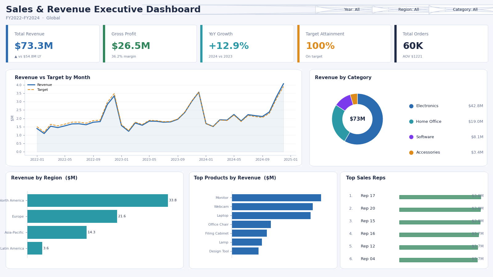

# Sales & Revenue Executive Dashboard (Power BI)

An executive sales dashboard built on a proper star-schema model, with time
intelligence, targets vs actuals, and drill-down across product, region, and rep.

Stack: Power BI Desktop, DAX, Power Query, Python (for the dataset)



## What it shows
A leadership view of a global tech-products company over three fiscal years
(2022 to 2024). It answers the questions an exec actually asks: are we growing, are we
hitting target, where is the money coming from, and who is driving it.

## The data
The dataset is synthetic and reproducible (`generate_data.py`, fixed seed), modelled as a
star schema so it behaves like a real warehouse extract:

- `fact_sales.csv` (60,000 rows): one row per order line with revenue, cost, profit, quantity, discount
- `dim_date.csv`: full calendar with year, quarter, month, weekday flags
- `dim_product.csv`: product, category, list price, standard cost
- `dim_region.csv`: region and country
- `dim_salesrep.csv`: rep and team
- `targets.csv`: monthly revenue target by region (for targets vs actuals)

## Headline numbers
- Total revenue: **$73.3M**, gross profit **$26.5M**, gross margin **36.2%**
- **+12.9%** year-over-year revenue growth (2024 vs 2023)
- **~100%** overall target attainment
- Electronics is the top category at **$42.8M** (about 58% of revenue); North America leads regions at **$33.8M**

## The data model
```
dim_date  ─┐
dim_product┤
dim_region ┼──►  fact_sales
dim_salesrep┘
targets ──►  linked to dim_date (Year, Month) and dim_region (RegionKey)
```
All relationships are single-direction, one-to-many from dimension to fact, which is the
clean star-schema setup Power BI is fastest on.

## Key DAX measures
Full set is in `measures.dax`. Highlights:
- `Total Revenue`, `Total Profit`, `Gross Margin %`, `Avg Order Value`
- `Revenue YoY %` using `SAMEPERIODLASTYEAR`
- `Revenue YTD` / `Revenue MTD` and a 3-month moving average
- `Target Attainment %` and `Revenue vs Target`
- `Attainment Status` for conditional formatting (On/Near/Below target)

## Report pages
1. **Executive Summary** — 5 KPI cards, revenue vs target trend, category donut, region and product bars, rep leaderboard (shown above)
2. **Regional Deep-Dive** — map + region/country matrix with margin and attainment
3. **Product Performance** — category to product drill-down, margin scatter
4. Slicers for Year, Region, and Category sync across all pages

## How to build it (about 30 minutes)
1. Install **Power BI Desktop** (free) and run `python generate_data.py` to create the CSVs.
2. **Get Data → Text/CSV** and load all six files.
3. In **Model view**, connect the dimensions to `fact_sales`, and connect `targets` to
   `dim_date` and `dim_region`. Mark `dim_date` as the date table.
4. Create a blank **`_Measures`** table and paste everything from `measures.dax`.
5. Build the Executive Summary page to match the mockup (KPI cards, line chart with the
   Target measure as a second line, donut, bar charts, leaderboard).
6. **Publish** to the Power BI Service, then **File → Publish to web** to get a public link
   you can drop into your resume and portfolio.

## Run the data build
```bash
pip install -r requirements.txt
python generate_data.py     # writes the CSVs to data/
python make_mockup.py       # regenerates dashboard_mockup.png
```
